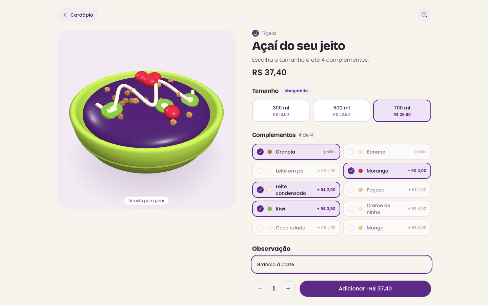
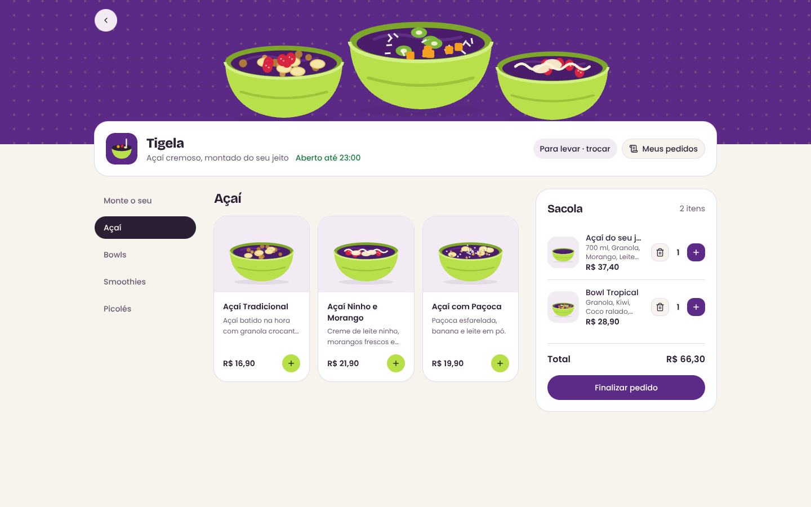
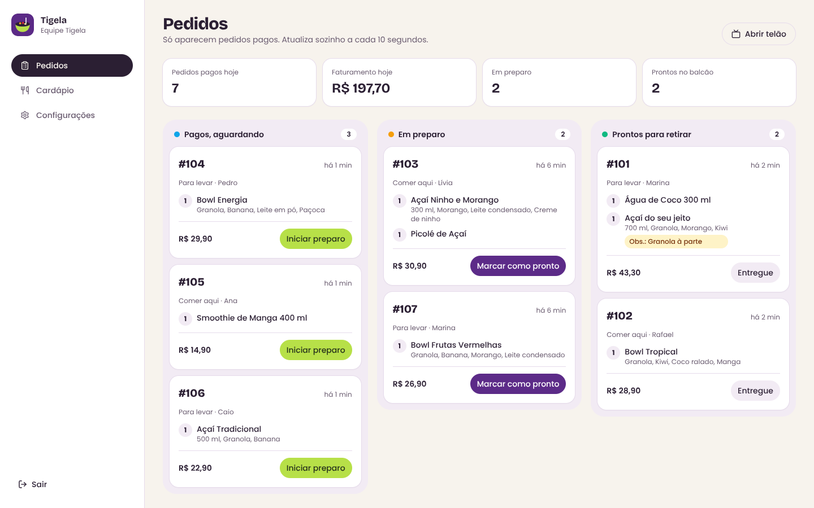
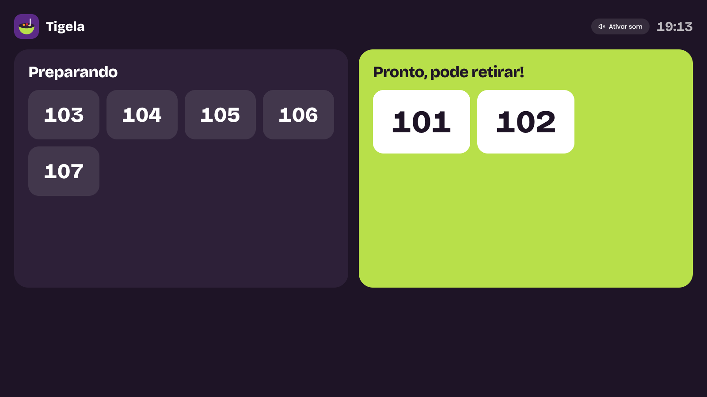
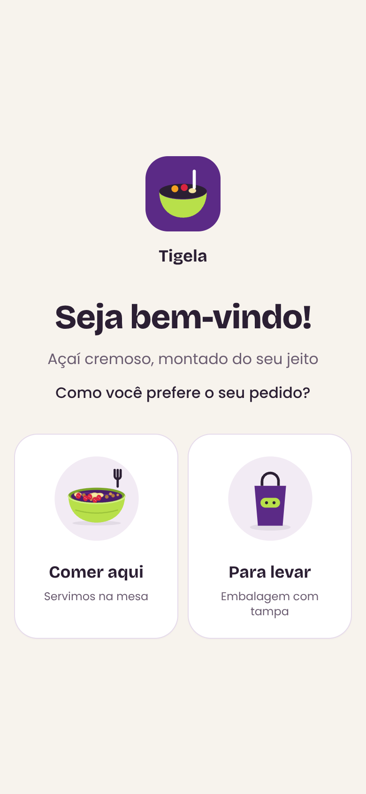
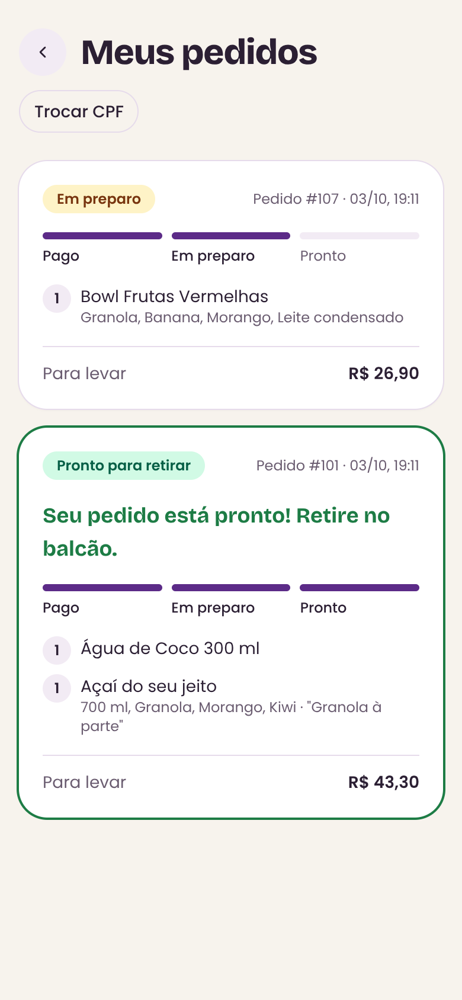

# SelfCheckApp

[](https://github.com/Dot010/SelfCheckApp/actions/workflows/ci.yml)

Sistema de autoatendimento para restaurantes: o cliente escolhe se vai comer no local ou levar, monta o pedido pelo cardápio digital, paga com Pix ou cartão pelo Stripe e acompanha o preparo em tempo real. A cozinha recebe os pedidos num painel próprio e um telão no balcão chama as senhas.



| Cardápio com sacola                        | Painel da cozinha                      |
| ------------------------------------------ | -------------------------------------- |
|  |  |

| Telão de senhas                      | Início (celular)                                                        | Meus pedidos (celular)                                                         |
| ------------------------------------ | ----------------------------------------------------------------------- | ------------------------------------------------------------------------------ |
|  |  |  |

## Tecnologias

- Next.js 15 (App Router, Server Components e Server Actions)
- React 19 e TypeScript
- Tailwind CSS e shadcn/ui
- Prisma ORM com PostgreSQL
- Stripe Checkout e webhooks
- Zod e React Hook Form para validação
- three.js e GSAP na prévia 3D do açaí
- Vitest, Playwright e GitHub Actions

## Restaurante de demonstração

O seed cria a **Tigela**, uma loja de açaí fictícia com açaís, bowls, smoothies e picolés. As ilustrações dos produtos, o logo e a capa são originais, feitos em SVG para este projeto, e ficam em `public/tigela`.

## Funcionalidades

- Escolha entre comer no local ou levar
- Cardápio por categorias, página de produto e sacola salva no navegador
- Monte seu açaí: tamanho, complementos com preço e limite de escolhas, observação e prévia em 3D (three.js + GSAP)
- Checkout com validação de nome e CPF
- Pagamento com Pix, cartão ou boleto pelo Stripe Checkout
- Status do pedido atualizado pelo webhook do Stripe, inclusive para pagamentos assíncronos (Pix e boleto)
- Consulta de pedidos pelo CPF, guardado em cookie e nunca na URL
- Status do pedido atualizado sozinho enquanto ele está em andamento, com aviso quando fica pronto
- Modo totem: abra qualquer página com `?totem=1` no aparelho do balcão. Depois de 60 s sem uso ele pergunta "Ainda está aí?" e, sem resposta, limpa a sacola e o CPF e volta ao início (`?totem=0` desliga)

### Telão de senhas (`/tigela/telao`)

- Números em preparo e prontos para retirar, para uma TV no balcão
- Destaque e aviso sonoro (após um toque em "Ativar som") quando um pedido fica pronto

### Painel do restaurante (`/tigela/admin`)

- Login com senha (hash scrypt) e sessão em cookie assinado (JWT)
- Quadro de pedidos pagos: Pagos → Em preparo → Prontos → Entregue, com atualização automática
- Cardápio: marcar produtos como esgotados e editar nome, descrição e preço
- Configurações: pausar pedidos, dados da loja e horário de funcionamento por dia

## Decisões técnicas

- **Preços em centavos (inteiros).** Valores monetários nunca usam ponto flutuante, evitando erros de arredondamento no total e no Stripe.
- **O servidor não confia no cliente.** Server Actions validam a entrada com Zod e buscam preços e itens no banco. A sessão do Stripe é montada a partir do pedido salvo.
- **Opções validadas no servidor.** Tamanho e complementos são conferidos contra os grupos do produto (mínimo, máximo e se a opção pertence ao produto), e o preço é recalculado pelo banco. O pedido guarda uma cópia das opções escolhidas.
- **Autenticação sem dependências pesadas.** Senhas com `scrypt` do próprio Node e sessão em JWT assinado com `jose`. O middleware protege as páginas do painel e cada server action confere a sessão de novo, porque actions podem ser chamadas diretamente.
- **Horário local do restaurante.** "Hoje", "aberto agora" e os horários de pedidos usam o fuso de São Paulo, independente do fuso do servidor.
- **Atualização por consulta periódica.** Pedidos, painel e telão recarregam os dados a cada poucos segundos (`router.refresh()`), só enquanto a aba está visível e, para o cliente, só enquanto há pedido em andamento. Em hospedagem serverless (Vercel) conexões longas como WebSocket não ficam abertas, então consultar periodicamente é o caminho mais confiável.
- **Webhook idempotente.** Só pedidos pendentes mudam de status, então eventos repetidos do Stripe não causam efeitos duplicados.
- **Testes onde o erro custa caro.** Os testes unitários cobrem CPF, regras de opções e preço, horário de funcionamento, senha e sessão. O teste ponta a ponta faz o caminho inteiro: monta um açaí, cria o pedido, confirma o pagamento por um webhook assinado (enviado duas vezes, para provar a idempotência), avança o pedido no painel e confere o telão e a tela do cliente.

## Estrutura

```text
src/
├── app/
│   ├── [slug]/                 # Páginas de cada restaurante
│   │   ├── menu/               # Cardápio, produto, sacola e checkout
│   │   │   ├── actions/        # Server Actions (criar pedido, checkout)
│   │   │   ├── contexts/       # Contexto da sacola
│   │   │   └── helpers/        # Validação de CPF
│   │   ├── orders/             # Acompanhamento de pedidos
│   │   ├── admin/              # Painel do restaurante (login, pedidos, cardápio, configurações)
│   │   └── telao/              # Telão de senhas
│   └── api/webhooks/stripe/    # Webhook do Stripe
├── components/                 # Componentes compartilhados e shadcn/ui
├── data/                       # Consultas reutilizáveis
├── helpers/                    # Moeda, opções, status e horário do restaurante
├── lib/                        # Prisma, Stripe, autenticação, cena 3D
└── middleware.ts               # Protege o painel
prisma/
├── schema.prisma
├── migrations/
└── seed.ts
tests/
├── unit/                       # Vitest
└── e2e/                        # Playwright
```

## Rodando localmente

Pré-requisitos: Node.js 20+, PostgreSQL e a [Stripe CLI](https://docs.stripe.com/stripe-cli).

```bash
git clone https://github.com/Dot010/SelfCheckApp.git
cd SelfCheckApp
npm install
cp .env.example .env   # preencha as variáveis
npx prisma migrate dev
npx prisma db seed
npm run dev
```

Acesse http://localhost:3000. A página inicial leva ao primeiro restaurante cadastrado. O painel fica em http://localhost:3000/tigela/admin (login de demonstração: `demo@tigela.com` / `tigela123`).

> O seed apaga os restaurantes existentes (e, em cascata, seus pedidos) antes de criar a Tigela.

### Formas de pagamento

O checkout mostra as formas de pagamento ativadas no painel do Stripe, em **Configurações → Pagamentos → Formas de pagamento**. Para aceitar Pix, ative-o ali; o código não precisa mudar. Pix e boleto são confirmados pelo webhook quando o pagamento cai.

### Testando pagamentos

Em outro terminal, encaminhe os eventos do Stripe para o webhook local:

```bash
stripe listen --forward-to localhost:3000/api/webhooks/stripe
```

Copie o `whsec_...` exibido para `STRIPE_WEBHOOK_SECRET_KEY` no `.env`. No checkout, use o cartão de teste `4242 4242 4242 4242`, com qualquer data futura e qualquer CVC.

## Qualidade

```bash
npm run lint        # ESLint
npm run typecheck   # TypeScript
npm test            # testes unitários (Vitest)
npm run test:e2e    # testes ponta a ponta (Playwright)
```

Os testes ponta a ponta usam o banco do `.env`, então rode-os num banco de desenvolvimento com o seed aplicado, nunca no de produção (eles deixam a loja aberta o dia todo; rode o seed de novo para voltar ao horário padrão). Na primeira vez, instale o navegador com `npx playwright install chromium`. O Playwright sobe o app com `npm start` (faça `npm run build` antes) ou reaproveita um servidor que já esteja rodando na porta 3000. O Stripe não é chamado de verdade: o pagamento é confirmado por um webhook assinado com o `STRIPE_WEBHOOK_SECRET_KEY` lido do `.env`, o mesmo que o app usa.

A cada push e pull request, o GitHub Actions roda lint, tipos, formatação, testes unitários e build, e em paralelo os testes ponta a ponta com um PostgreSQL próprio.

## Publicando (checklist)

1. **Gere um `AUTH_SECRET` novo só para produção** com `node -e "console.log(require('crypto').randomBytes(32).toString('base64'))"`. Não reaproveite o do seu `.env` local.
2. Na Vercel, cadastre as variáveis de ambiente: `DATABASE_URL`, `STRIPE_SECRET_KEY`, `STRIPE_WEBHOOK_SECRET_KEY`, `AUTH_SECRET` e, se quiser mostrar o login de demonstração, `SHOW_DEMO_LOGIN="true"`.
3. No Stripe, crie um webhook para `https://SEU-DOMINIO/api/webhooks/stripe` com os eventos `checkout.session.completed`, `checkout.session.async_payment_succeeded`, `checkout.session.async_payment_failed` e `checkout.session.expired`. O `whsec_...` desse webhook é o `STRIPE_WEBHOOK_SECRET_KEY` de produção (não é o mesmo do `stripe listen`).
4. Ative o Pix em **Configurações → Pagamentos → Formas de pagamento** no Stripe.
5. Aplique as migrations e o seed no banco de produção: `npx prisma migrate deploy` e `npx prisma db seed` com a `DATABASE_URL` de produção.
6. Confira o nome da conta do Stripe, que aparece na página de pagamento.
7. Troque a senha do login de demonstração, ou desligue `SHOW_DEMO_LOGIN`, se a loja for usada de verdade.

## Autor

Jonathan Carvalho, [GitHub](https://github.com/Dot010)
